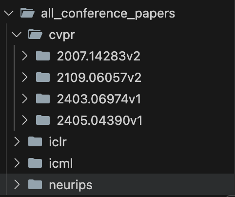

# 🐛 Crawl Paper

## Introduction
This is an implementation of crawling papers that are admitted by the four conferences, namely ICML, ICLR, CVPR and. NeurIPS, from arxiv.

The code first gets the title of the papers, and then fetches the tex source code of the paper and seperate the images from each paper, then stored them together with other information under the folders named by their conferences, respectively. Each paper is stored under the folder named by its arxiv id. See screenshot below.



Note: Every time you run the script, three (if not crawled before) new papers will be added into each of the conferences folder.

## How to use
### 1. Install required packages
```bash
pip install -r requirements.txt
```

### 2. Run the crawl code
```bash
python new_crawl.py
```